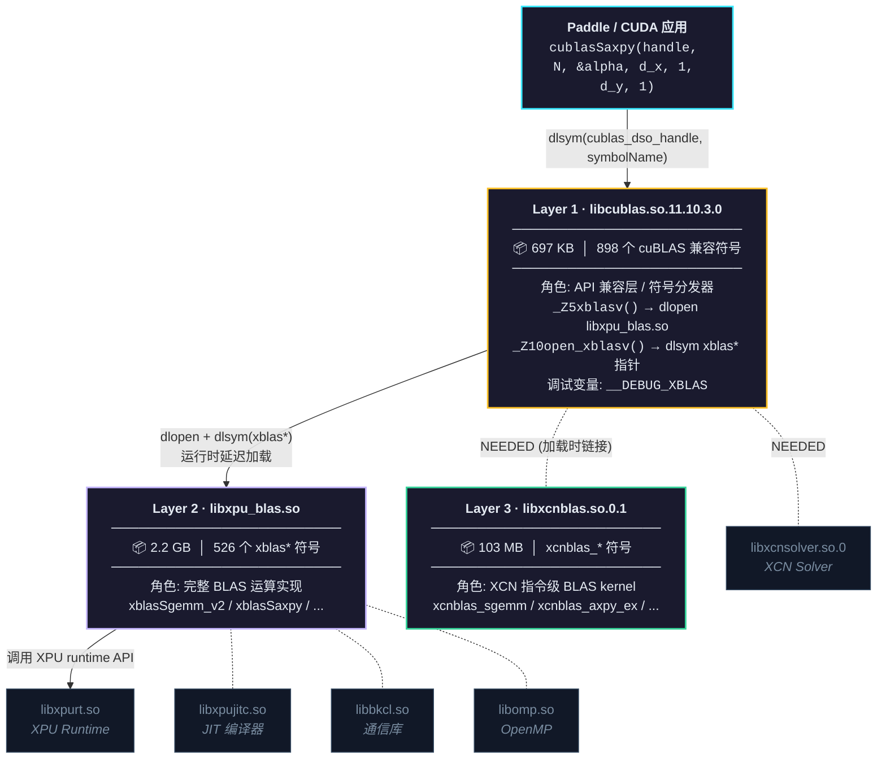

M100 Paddle cuBLAS 函数恢复验证记录

# 背景
commit `2d58be6` 将 `blas_impl.cu.h` 中多个 cuBLAS 函数标记为 "not implemented for xcuda"，用 `PADDLE_THROW(Unimplemented(...))` 替代了实际调用。同时在 `paddle/phi/backends/dynload/cublas.h` 中注释掉了对应的动态加载注册。

经验证，当前版本的 xtrans（`xtrans_cuda_11.7_ubuntu2004_x86_64_mars`）已经实现了其中大部分函数，可以恢复。

## 验证方法
### 第一步：确认 xtrans 导出符号
通过 `nm -D` 检查 `libcublas.so` 的符号表：

```bash
XTRANS=/home/shuzhenyi/code/m100/xtrans_cuda_11.7_ubuntu2004_x86_64_mars
nm -D ${XTRANS}/lib64/libcublas.so | grep -i "cublas.*axpy\|cublas.*scal\|cublas.*copy\|cublas.*trsm\|cublas.*getri\|cublas.*matinv"
```
结论：

|函数|xtrans 是否导出|
|-|-|
|`cublasSaxpy` / `cublasDaxpy` / `cublasCaxpy` / `cublasZaxpy`|有|
|`cublasSscal` / `cublasDscal`|有|
|`cublasScopy` / `cublasDcopy`|有|
|`cublasSgetriBatched` / `cublasDgetriBatched` / `cublasCgetriBatched` / `cublasZgetriBatched`|有|
|`cublasStrsmBatched` / `cublasDtrsmBatched` / `cublasCtrsmBatched` / `cublasZtrsmBatched`|有|
|`cublasSmatinvBatched` / `cublasDmatinvBatched` / `cublasCmatinvBatched` / `cublasZmatinvBatched`|**没有**|

### 第二步：独立 CUDA 程序验证
编写 `/tmp/test_cublas_functions.cu`，在 M100 模拟器上逐个调用上述函数并校验结果。

测试源码：

```cpp
#include <stdio.h>
#include <math.h>
#include <cuda_runtime.h>
#include <cublas_v2.h>

#define CHECK_CUDA(x) do { \
    cudaError_t err = (x); \
    if (err != cudaSuccess) { printf("CUDA error %d at %s:%d\n", err, __FILE__, __LINE__); return 1; } \
} while(0)

#define CHECK_CUBLAS(x) do { \
    cublasStatus_t s = (x); \
    if (s != CUBLAS_STATUS_SUCCESS) { printf("cuBLAS error %d at %s:%d\n", s, __FILE__, __LINE__); return 1; } \
} while(0)

int test_saxpy(cublasHandle_t handle) {
    printf("--- Test cublasSaxpy ---\n");
    int N = 4;
    float h_x[] = {1.0, 2.0, 3.0, 4.0};
    float h_y[] = {10.0, 20.0, 30.0, 40.0};
    float alpha = 2.0f;
    // Expected: y = alpha*x + y = [12, 24, 36, 48]

    float *d_x, *d_y;
    CHECK_CUDA(cudaMalloc(&d_x, N*sizeof(float)));
    CHECK_CUDA(cudaMalloc(&d_y, N*sizeof(float)));
    CHECK_CUDA(cudaMemcpy(d_x, h_x, N*sizeof(float), cudaMemcpyHostToDevice));
    CHECK_CUDA(cudaMemcpy(d_y, h_y, N*sizeof(float), cudaMemcpyHostToDevice));

    CHECK_CUBLAS(cublasSaxpy(handle, N, &alpha, d_x, 1, d_y, 1));
    CHECK_CUDA(cudaDeviceSynchronize());

    float result[4];
    CHECK_CUDA(cudaMemcpy(result, d_y, N*sizeof(float), cudaMemcpyDeviceToHost));
    printf("  Result: [%.1f, %.1f, %.1f, %.1f]\n", result[0], result[1], result[2], result[3]);
    printf("  Expect: [12.0, 24.0, 36.0, 48.0]\n");

    int pass = (result[0]==12.0f && result[1]==24.0f && result[2]==36.0f && result[3]==48.0f);
    printf("  %s\n\n", pass ? "PASS" : "FAIL");

    cudaFree(d_x); cudaFree(d_y);
    return pass ? 0 : 1;
}

int test_daxpy(cublasHandle_t handle) {
    printf("--- Test cublasDaxpy ---\n");
    int N = 4;
    double h_x[] = {1.0, 2.0, 3.0, 4.0};
    double h_y[] = {10.0, 20.0, 30.0, 40.0};
    double alpha = 3.0;

    double *d_x, *d_y;
    CHECK_CUDA(cudaMalloc(&d_x, N*sizeof(double)));
    CHECK_CUDA(cudaMalloc(&d_y, N*sizeof(double)));
    CHECK_CUDA(cudaMemcpy(d_x, h_x, N*sizeof(double), cudaMemcpyHostToDevice));
    CHECK_CUDA(cudaMemcpy(d_y, h_y, N*sizeof(double), cudaMemcpyHostToDevice));

    CHECK_CUBLAS(cublasDaxpy(handle, N, &alpha, d_x, 1, d_y, 1));
    CHECK_CUDA(cudaDeviceSynchronize());

    double result[4];
    CHECK_CUDA(cudaMemcpy(result, d_y, N*sizeof(double), cudaMemcpyDeviceToHost));
    printf("  Result: [%.1f, %.1f, %.1f, %.1f]\n", result[0], result[1], result[2], result[3]);
    printf("  Expect: [13.0, 26.0, 39.0, 52.0]\n");

    int pass = (result[0]==13.0 && result[1]==26.0 && result[2]==39.0 && result[3]==52.0);
    printf("  %s\n\n", pass ? "PASS" : "FAIL");

    cudaFree(d_x); cudaFree(d_y);
    return pass ? 0 : 1;
}

int test_sscal(cublasHandle_t handle) {
    printf("--- Test cublasSscal ---\n");
    int N = 4;
    float h_x[] = {2.0, 4.0, 6.0, 8.0};
    float alpha = 0.5f;
    // Expected: x = alpha*x = [1, 2, 3, 4]

    float *d_x;
    CHECK_CUDA(cudaMalloc(&d_x, N*sizeof(float)));
    CHECK_CUDA(cudaMemcpy(d_x, h_x, N*sizeof(float), cudaMemcpyHostToDevice));

    CHECK_CUBLAS(cublasSscal(handle, N, &alpha, d_x, 1));
    CHECK_CUDA(cudaDeviceSynchronize());

    float result[4];
    CHECK_CUDA(cudaMemcpy(result, d_x, N*sizeof(float), cudaMemcpyDeviceToHost));
    printf("  Result: [%.1f, %.1f, %.1f, %.1f]\n", result[0], result[1], result[2], result[3]);
    printf("  Expect: [1.0, 2.0, 3.0, 4.0]\n");

    int pass = (result[0]==1.0f && result[1]==2.0f && result[2]==3.0f && result[3]==4.0f);
    printf("  %s\n\n", pass ? "PASS" : "FAIL");

    cudaFree(d_x);
    return pass ? 0 : 1;
}

int test_dscal(cublasHandle_t handle) {
    printf("--- Test cublasDscal ---\n");
    int N = 4;
    double h_x[] = {3.0, 6.0, 9.0, 12.0};
    double alpha = 2.0;

    double *d_x;
    CHECK_CUDA(cudaMalloc(&d_x, N*sizeof(double)));
    CHECK_CUDA(cudaMemcpy(d_x, h_x, N*sizeof(double), cudaMemcpyHostToDevice));

    CHECK_CUBLAS(cublasDscal(handle, N, &alpha, d_x, 1));
    CHECK_CUDA(cudaDeviceSynchronize());

    double result[4];
    CHECK_CUDA(cudaMemcpy(result, d_x, N*sizeof(double), cudaMemcpyDeviceToHost));
    printf("  Result: [%.1f, %.1f, %.1f, %.1f]\n", result[0], result[1], result[2], result[3]);
    printf("  Expect: [6.0, 12.0, 18.0, 24.0]\n");

    int pass = (result[0]==6.0 && result[1]==12.0 && result[2]==18.0 && result[3]==24.0);
    printf("  %s\n\n", pass ? "PASS" : "FAIL");

    cudaFree(d_x);
    return pass ? 0 : 1;
}

int test_scopy(cublasHandle_t handle) {
    printf("--- Test cublasScopy ---\n");
    int N = 4;
    float h_x[] = {11.0, 22.0, 33.0, 44.0};

    float *d_x, *d_y;
    CHECK_CUDA(cudaMalloc(&d_x, N*sizeof(float)));
    CHECK_CUDA(cudaMalloc(&d_y, N*sizeof(float)));
    CHECK_CUDA(cudaMemcpy(d_x, h_x, N*sizeof(float), cudaMemcpyHostToDevice));
    CHECK_CUDA(cudaMemset(d_y, 0, N*sizeof(float)));

    CHECK_CUBLAS(cublasScopy(handle, N, d_x, 1, d_y, 1));
    CHECK_CUDA(cudaDeviceSynchronize());

    float result[4];
    CHECK_CUDA(cudaMemcpy(result, d_y, N*sizeof(float), cudaMemcpyDeviceToHost));
    printf("  Result: [%.1f, %.1f, %.1f, %.1f]\n", result[0], result[1], result[2], result[3]);
    printf("  Expect: [11.0, 22.0, 33.0, 44.0]\n");

    int pass = (result[0]==11.0f && result[1]==22.0f && result[2]==33.0f && result[3]==44.0f);
    printf("  %s\n\n", pass ? "PASS" : "FAIL");

    cudaFree(d_x); cudaFree(d_y);
    return pass ? 0 : 1;
}

int test_dcopy(cublasHandle_t handle) {
    printf("--- Test cublasDcopy ---\n");
    int N = 4;
    double h_x[] = {100.0, 200.0, 300.0, 400.0};

    double *d_x, *d_y;
    CHECK_CUDA(cudaMalloc(&d_x, N*sizeof(double)));
    CHECK_CUDA(cudaMalloc(&d_y, N*sizeof(double)));
    CHECK_CUDA(cudaMemcpy(d_x, h_x, N*sizeof(double), cudaMemcpyHostToDevice));
    CHECK_CUDA(cudaMemset(d_y, 0, N*sizeof(double)));

    CHECK_CUBLAS(cublasDcopy(handle, N, d_x, 1, d_y, 1));
    CHECK_CUDA(cudaDeviceSynchronize());

    double result[4];
    CHECK_CUDA(cudaMemcpy(result, d_y, N*sizeof(double), cudaMemcpyDeviceToHost));
    printf("  Result: [%.1f, %.1f, %.1f, %.1f]\n", result[0], result[1], result[2], result[3]);
    printf("  Expect: [100.0, 200.0, 300.0, 400.0]\n");

    int pass = (result[0]==100.0 && result[1]==200.0 && result[2]==300.0 && result[3]==400.0);
    printf("  %s\n\n", pass ? "PASS" : "FAIL");

    cudaFree(d_x); cudaFree(d_y);
    return pass ? 0 : 1;
}

int test_strsm(cublasHandle_t handle) {
    printf("--- Test cublasStrsm (single) ---\n");
    // Solve A * X = B where A is lower triangular identity, so X = B
    int N = 2;
    float h_A[] = {1.0, 0.0, 0.0, 1.0};  // col-major identity
    float h_B[] = {3.0, 7.0, 5.0, 11.0};

    float *d_A, *d_B;
    CHECK_CUDA(cudaMalloc(&d_A, 4*sizeof(float)));
    CHECK_CUDA(cudaMalloc(&d_B, 4*sizeof(float)));
    CHECK_CUDA(cudaMemcpy(d_A, h_A, 4*sizeof(float), cudaMemcpyHostToDevice));
    CHECK_CUDA(cudaMemcpy(d_B, h_B, 4*sizeof(float), cudaMemcpyHostToDevice));

    float alpha = 1.0f;
    CHECK_CUBLAS(cublasStrsm(handle, CUBLAS_SIDE_LEFT, CUBLAS_FILL_MODE_LOWER,
                             CUBLAS_OP_N, CUBLAS_DIAG_NON_UNIT,
                             N, N, &alpha, d_A, N, d_B, N));
    CHECK_CUDA(cudaDeviceSynchronize());

    float result[4];
    CHECK_CUDA(cudaMemcpy(result, d_B, 4*sizeof(float), cudaMemcpyDeviceToHost));
    printf("  Result: [%.1f, %.1f, %.1f, %.1f]\n", result[0], result[1], result[2], result[3]);
    printf("  Expect: [3.0, 7.0, 5.0, 11.0] (A=I, so X=B)\n");

    int pass = (result[0]==3.0f && result[1]==7.0f && result[2]==5.0f && result[3]==11.0f);
    printf("  %s\n\n", pass ? "PASS" : "FAIL");

    cudaFree(d_A); cudaFree(d_B);
    return pass ? 0 : 1;
}

int test_strsm_batched(cublasHandle_t handle) {
    printf("--- Test cublasStrsmBatched ---\n");
    int N = 2, batchCount = 2;

    float h_A1[] = {1.0, 0.0, 0.0, 1.0};
    float h_A2[] = {1.0, 0.0, 0.0, 1.0};
    float h_B1[] = {1.0, 2.0, 3.0, 4.0};
    float h_B2[] = {5.0, 6.0, 7.0, 8.0};

    float *d_A1, *d_A2, *d_B1, *d_B2;
    CHECK_CUDA(cudaMalloc(&d_A1, 4*sizeof(float)));
    CHECK_CUDA(cudaMalloc(&d_A2, 4*sizeof(float)));
    CHECK_CUDA(cudaMalloc(&d_B1, 4*sizeof(float)));
    CHECK_CUDA(cudaMalloc(&d_B2, 4*sizeof(float)));
    CHECK_CUDA(cudaMemcpy(d_A1, h_A1, 4*sizeof(float), cudaMemcpyHostToDevice));
    CHECK_CUDA(cudaMemcpy(d_A2, h_A2, 4*sizeof(float), cudaMemcpyHostToDevice));
    CHECK_CUDA(cudaMemcpy(d_B1, h_B1, 4*sizeof(float), cudaMemcpyHostToDevice));
    CHECK_CUDA(cudaMemcpy(d_B2, h_B2, 4*sizeof(float), cudaMemcpyHostToDevice));

    float *h_Aarray[] = {d_A1, d_A2};
    float *h_Barray[] = {d_B1, d_B2};
    float **d_Aarray, **d_Barray;
    CHECK_CUDA(cudaMalloc(&d_Aarray, 2*sizeof(float*)));
    CHECK_CUDA(cudaMalloc(&d_Barray, 2*sizeof(float*)));
    CHECK_CUDA(cudaMemcpy(d_Aarray, h_Aarray, 2*sizeof(float*), cudaMemcpyHostToDevice));
    CHECK_CUDA(cudaMemcpy(d_Barray, h_Barray, 2*sizeof(float*), cudaMemcpyHostToDevice));

    float alpha = 1.0f;
    CHECK_CUBLAS(cublasStrsmBatched(handle, CUBLAS_SIDE_LEFT, CUBLAS_FILL_MODE_LOWER,
                                    CUBLAS_OP_N, CUBLAS_DIAG_NON_UNIT,
                                    N, N, &alpha, (float* const*)d_Aarray, N,
                                    d_Barray, N, batchCount));
    CHECK_CUDA(cudaDeviceSynchronize());

    float r1[4], r2[4];
    CHECK_CUDA(cudaMemcpy(r1, d_B1, 4*sizeof(float), cudaMemcpyDeviceToHost));
    CHECK_CUDA(cudaMemcpy(r2, d_B2, 4*sizeof(float), cudaMemcpyDeviceToHost));
    printf("  Batch0: [%.1f, %.1f, %.1f, %.1f]\n", r1[0], r1[1], r1[2], r1[3]);
    printf("  Batch1: [%.1f, %.1f, %.1f, %.1f]\n", r2[0], r2[1], r2[2], r2[3]);
    printf("  Expect: same as input (A=I)\n");

    int pass = (r1[0]==1.0f && r1[1]==2.0f && r1[2]==3.0f && r1[3]==4.0f &&
                r2[0]==5.0f && r2[1]==6.0f && r2[2]==7.0f && r2[3]==8.0f);
    printf("  %s\n\n", pass ? "PASS" : "FAIL");

    cudaFree(d_A1); cudaFree(d_A2); cudaFree(d_B1); cudaFree(d_B2);
    cudaFree(d_Aarray); cudaFree(d_Barray);
    return pass ? 0 : 1;
}

int test_sgetri_batched(cublasHandle_t handle) {
    printf("--- Test cublasSgetriBatched ---\n");
    // Inverse of 2x2 identity = identity
    int N = 2, batchCount = 1;

    float h_A[] = {1.0, 0.0, 0.0, 1.0};
    int h_pivot[] = {1, 2};
    int h_info[] = {0};

    float *d_A, *d_C;
    int *d_pivot, *d_info;
    CHECK_CUDA(cudaMalloc(&d_A, 4*sizeof(float)));
    CHECK_CUDA(cudaMalloc(&d_C, 4*sizeof(float)));
    CHECK_CUDA(cudaMalloc(&d_pivot, 2*sizeof(int)));
    CHECK_CUDA(cudaMalloc(&d_info, sizeof(int)));
    CHECK_CUDA(cudaMemcpy(d_A, h_A, 4*sizeof(float), cudaMemcpyHostToDevice));
    CHECK_CUDA(cudaMemcpy(d_pivot, h_pivot, 2*sizeof(int), cudaMemcpyHostToDevice));
    CHECK_CUDA(cudaMemset(d_C, 0, 4*sizeof(float)));

    float *h_Aarray[] = {d_A};
    float *h_Carray[] = {d_C};

    float **d_Aarray, **d_Carray;
    CHECK_CUDA(cudaMalloc(&d_Aarray, sizeof(float*)));
    CHECK_CUDA(cudaMalloc(&d_Carray, sizeof(float*)));
    CHECK_CUDA(cudaMemcpy(d_Aarray, h_Aarray, sizeof(float*), cudaMemcpyHostToDevice));
    CHECK_CUDA(cudaMemcpy(d_Carray, h_Carray, sizeof(float*), cudaMemcpyHostToDevice));

    CHECK_CUBLAS(cublasSgetriBatched(handle, N,
                                     (float* const*)d_Aarray, N,
                                     d_pivot,
                                     d_Carray, N,
                                     d_info, batchCount));
    CHECK_CUDA(cudaDeviceSynchronize());

    float result[4];
    int info_result;
    CHECK_CUDA(cudaMemcpy(result, d_C, 4*sizeof(float), cudaMemcpyDeviceToHost));
    CHECK_CUDA(cudaMemcpy(&info_result, d_info, sizeof(int), cudaMemcpyDeviceToHost));
    printf("  Result: [%.1f, %.1f, %.1f, %.1f], info=%d\n",
           result[0], result[1], result[2], result[3], info_result);
    printf("  Expect: [1.0, 0.0, 0.0, 1.0] (inv(I)=I), info=0\n");

    int pass = (fabsf(result[0]-1.0f)<1e-5 && fabsf(result[1])<1e-5 &&
                fabsf(result[2])<1e-5 && fabsf(result[3]-1.0f)<1e-5 && info_result==0);
    printf("  %s\n\n", pass ? "PASS" : "FAIL");

    cudaFree(d_A); cudaFree(d_C); cudaFree(d_pivot); cudaFree(d_info);
    cudaFree(d_Aarray); cudaFree(d_Carray);
    return pass ? 0 : 1;
}

int main() {
    printf("====== cuBLAS Functions Verification on M100 Simulator ======\n\n");

    cublasHandle_t handle;
    CHECK_CUBLAS(cublasCreate(&handle));

    int failures = 0;
    failures += test_saxpy(handle);
    failures += test_daxpy(handle);
    failures += test_sscal(handle);
    failures += test_dscal(handle);
    failures += test_scopy(handle);
    failures += test_dcopy(handle);
    failures += test_strsm(handle);
    failures += test_strsm_batched(handle);
    failures += test_sgetri_batched(handle);

    printf("====== Summary: %d/%d tests passed ======\n", 9-failures, 9);

    cublasDestroy(handle);
    return failures;
}
```
编译与运行：

```bash
# 编译
${XTRANS}/bin/nvcc -o /tmp/test_cublas_functions /tmp/test_cublas_functions.cu \
  -I${XTRANS}/include \
  -L${XTRANS}/targets/x86_64-linux/lib -L${XTRANS}/lib64 \
  -lcudart -lxpurt -lcublas

# 运行（需提前设置模拟器环境变量）
/tmp/test_cublas_functions
```
运行结果：

```
====== cuBLAS Functions Verification on M100 Simulator ======

--- Test cublasSaxpy ---
  Result: [12.0, 24.0, 36.0, 48.0]
  Expect: [12.0, 24.0, 36.0, 48.0]
  PASS

--- Test cublasDaxpy ---
  Result: [13.0, 26.0, 39.0, 52.0]
  Expect: [13.0, 26.0, 39.0, 52.0]
  PASS

--- Test cublasSscal ---
  Result: [1.0, 2.0, 3.0, 4.0]
  Expect: [1.0, 2.0, 3.0, 4.0]
  PASS

--- Test cublasDscal ---
  Result: [6.0, 12.0, 18.0, 24.0]
  Expect: [6.0, 12.0, 18.0, 24.0]
  PASS

--- Test cublasScopy ---
  Result: [11.0, 22.0, 33.0, 44.0] 
  Expect: [11.0, 22.0, 33.0, 44.0]
  PASS

--- Test cublasDcopy ---
  Result: [100.0, 200.0, 300.0, 400.0]
  Expect: [100.0, 200.0, 300.0, 400.0]
  PASS

--- Test cublasStrsm (single) ---
  Result: [3.0, 7.0, 5.0, 11.0]
  Expect: [3.0, 7.0, 5.0, 11.0] (A=I, so X=B)
  PASS

--- Test cublasStrsmBatched ---
  Batch0: [1.0, 2.0, 3.0, 4.0]
  Batch1: [5.0, 6.0, 7.0, 8.0]
  Expect: same as input (A=I)
  PASS

--- Test cublasSgetriBatched ---
  Result: [1.0, 0.0, 0.0, 1.0], info=0
  Expect: [1.0, 0.0, 0.0, 1.0] (inv(I)=I), info=0
  PASS

====== Summary: 9/9 tests passed ======
```
### 第三步：修改 Paddle 代码
#### 文件 1：`paddle/phi/backends/dynload/cublas.h`
在 `CUBLAS_BLAS_ROUTINE_EACH` 宏中新增 8 个符号注册：

```cpp
__macro(cublasSaxpy);
__macro(cublasDaxpy);
__macro(cublasCaxpy);
__macro(cublasZaxpy);
__macro(cublasSscal);
__macro(cublasDscal);
__macro(cublasScopy);
__macro(cublasDcopy);
```
注意：xtrans 中这些符号**不带 **`_v2`** 后缀**（与 `cublasSgemv_v2` 等不同）。

#### 文件 2：`paddle/phi/kernels/funcs/blas/blas_impl.cu.h`
恢复的函数（将 `PADDLE_THROW(Unimplemented(...))` 替换为 `PADDLE_ENFORCE_GPU_SUCCESS(phi::dynload::xxx(args...))`）：

|类型|恢复的函数|
|-|-|
|float (CUBlas<float>)|AXPY, SCAL, VCOPY, GETRI_BATCH, TRSM_BATCH|
|double (CUBlas<double>)|AXPY, SCAL, VCOPY, GETRI_BATCH, TRSM_BATCH|
|complex64|AXPY|
|complex128|AXPY|

保持禁用的函数（xtrans 未导出）：

|类型|保持禁用|
|-|-|
|float|MATINV_BATCH (`cublasSmatinvBatched`)|
|double|MATINV_BATCH (`cublasDmatinvBatched`)|
|complex64|MATINV_BATCH (`cublasCmatinvBatched`)|
|complex128|MATINV_BATCH (`cublasZmatinvBatched`)|

### 第四步：编译验证
```bash
source /home/shuzhenyi/code/m100/Paddle/env_xcuda.sh
cd /home/shuzhenyi/code/m100/Paddle/build
make -j$(nproc)
```
编译成功，产出 `libphi_gpu.so` 和 `libpaddle.so`。

### 第五步：Paddle 端到端验证
在 M100 模拟器上运行 Python 测试：

```python
import paddle
import numpy as np
paddle.set_device('gpu:0')

# axpy 路径验证
result = paddle.add(2.0 * paddle.to_tensor([1.0, 2.0, 3.0, 4.0]),
                    paddle.to_tensor([10.0, 20.0, 30.0, 40.0]))
assert np.allclose(result.numpy(), [12, 24, 36, 48])

# scal 路径验证
result = paddle.scale(paddle.to_tensor([2.0, 4.0, 6.0, 8.0]), scale=0.5)
assert np.allclose(result.numpy(), [1, 2, 3, 4])

# copy 路径验证
x = paddle.to_tensor([11.0, 22.0, 33.0, 44.0])
y = x.clone()
assert np.allclose(y.numpy(), x.numpy())

# matmul
m1 = paddle.to_tensor([[1.0, 2.0], [3.0, 4.0]])
m2 = paddle.to_tensor([[5.0, 6.0], [7.0, 8.0]])
assert np.allclose(paddle.matmul(m1, m2).numpy(), [[19, 22], [43, 50]])

# linear
linear = paddle.nn.Linear(4, 2)
assert linear(paddle.randn([2, 4])).shape == [2, 2]

# backward（内部使用 axpy/scal）
x = paddle.to_tensor([[1.0, 2.0, 3.0, 4.0]], stop_gradient=False)
y = paddle.sum(x * x)
y.backward()
assert np.allclose(x.grad.numpy(), [[2, 4, 6, 8]])
```
全部通过。

## 结论
xtrans 当前版本已实现 commit `2d58be6` 中被禁用的大部分 cuBLAS 函数。恢复后编译、模拟器运行均正常。唯一仍需保持禁用的是 `matinvBatched` 系列（4 个函数），cublas shim 未映射。

## 关于 matinvBatched：shim 遗漏而非实现缺失
xtrans 的 cuBLAS 支持分为两层：

```
应用代码调用 cublasSgemm(...)
       ↓
libcublas.so.11.10.3.0 (697KB, cublas shim)
  内部: dlopen("libxpu_blas.so") → dlsym("xblasSgemm_v2")
       ↓
libxpu_blas.so (2.2GB, xBLAS 完整实现)
  执行实际计算
```
shim 的作用是把标准 NVIDIA cuBLAS API 名字透明转发到 KunlunXin 的 xBLAS 实现，应用层代码无需修改。

`matinvBatched`** 的真实情况：**

```bash
# xBLAS 实现层：matinvBatched 已实现
$ nm -D libxpu_blas.so | grep matinv
000000000271a130 T xblasCmatinvBatched
0000000002719220 T xblasDmatinvBatched
0000000002719210 T xblasSmatinvBatched
000000000271b050 T xblasZmatinvBatched

# cublas shim 层：未映射
$ nm -D libcublas.so.11.10.3.0 | grep matinv
（无输出）
```
结论：`xblasSmatinvBatched` 等函数在底层 `libxpu_blas.so` 中**已经实现**，但 cublas shim 没有为它们生成 `cublasSmatinvBatched` → `xblasSmatinvBatched` 的转发入口。这是 shim 的映射遗漏，不是底层实现缺失。

**后续解决方案（二选一）：**

1. **等 KunlunXin 更新 shim**：让他们在 `libcublas.so` 中补上 `cublasSmatinvBatched` 等 4 个转发。
2. **Paddle 侧绕过 shim**：直接 dlopen `libxpu_blas.so` 调用 `xblasSmatinvBatched`，无需等待 shim 更新。

当前 `matinvBatched` 仅影响 `paddle.linalg.inv` 的特定路径，优先级不高。

## xtrans cuBLAS Shim 架构详解
### 整体定位
xtrans SDK 不是让用户重新编译 cuBLAS，而是提供一组**预编译的 shim .so**，在运行时冒充 NVIDIA 的同名库。应用代码（包括 Paddle）无需修改链接目标，只要 `LD_LIBRARY_PATH` 指向 xtrans 的 lib 目录即可。

这些 shim .so 全部来自 xtrans SDK 预编译发布（`xtrans_cuda_11.7_ubuntu2004_x86_64_mars/targets/x86_64-linux/lib/`），**不是** xtrans 编译器的编译产物，也**不是**从这个仓库构建的。它们由昆仑芯内部团队编译后随 SDK 打包分发，源码非公开。

### 文件清单与大小
```
targets/x86_64-linux/lib/
├── libcublas.so → libcublas.so.11 → libcublas.so.11.10.3.0   (697KB)
├── libcublasLt.so → ... → libcublasLt.so.11.10.3.0           (54KB)
├── libcublas_static.a                                          (960KB)
├── libxpu_blas.so                                              (2.2GB)
├── libxcnblas.so → libxcnblas.so.0 → libxcnblas.so.0.1       (103MB)
└── ... (libcudart.so, libcudnn.so 等其他 shim)
```
### 三层架构

> **图例**：实线箭头 = 运行时动态调用（dlopen/dlsym）；虚线 = 加载时链接（ELF NEEDED）。
**各层职责速查**：

|层级|文件|大小|导出符号|连接方式|构建团队|
|-|-|-|-|-|-|
|Layer 1|`libcublas.so.11.10.3.0`|697KB|898 个 `cublas*`|Paddle dlsym 加载|XRE / XTDK|
|Layer 2|`libxpu_blas.so`|2.2GB|526 个 `xblas*`|Layer 1 dlopen 加载|XPUMATH|
|Layer 3|`libxcnblas.so.0.1`|103MB|`xcnblas_*`|Layer 1 NEEDED 链接|XRE|

### shim 内部工作机制
通过反汇编和符号分析可以确认 shim 的转发逻辑：

```bash
# 查看 shim 的关键内部函数
$ nm -D libcublas.so.11.10.3.0 | grep -E "xblas|dlopen|dlsym"
0000000000086780 B __DEBUG_XBLAS
                 U dlopen              # 从 libc 导入
                 U dlsym               # 从 libc 导入
0000000000062150 T _Z10open_xblasv     # 初始化 xBLAS 连接
0000000000062b00 T _Z5xblasv           # dlopen libxpu_blas.so 入口
```
```cpp
// shim 伪代码 (逆向推断):
static void* xblas_handle = nullptr;
static void* fn_table[N] = {};

void _Z5xblasv() {
    xblas_handle = dlopen("libxpu_blas.so", RTLD_LAZY);
    fn_table[SAXPY] = dlsym(xblas_handle, "xblasSaxpy");
    fn_table[SGEMM] = dlsym(xblas_handle, "xblasSgemm_v2");
    // ... 所有已映射符号
}

cublasStatus_t cublasSaxpy(handle, n, alpha, x, incx, y, incy) {
    if (!xblas_handle) _Z5xblasv();  // lazy init
    return fn_table[SAXPY](handle, n, alpha, x, incx, y, incy);
}
```
### _v2 后缀规则
#### 什么是 _v2？
NVIDIA cuBLAS 经历过一次重大 API 迭代。初版 cuBLAS（v1）使用全局状态，不需要传 handle：

```c
// cuBLAS v1 (已废弃)：全局状态，无 handle
cublasSaxpy(N, alpha, d_x, 1, d_y, 1);
cublasGetError();  // 通过全局函数获取错误
```
v2 版本引入了显式 handle，使 cuBLAS 线程安全、支持多 GPU：

```c
// cuBLAS v2 (当前标准)：显式 handle，函数返回状态码
cublasHandle_t handle;
cublasCreate(&handle);
cublasSaxpy(handle, N, &alpha, d_x, 1, d_y, 1);  // 多了 handle 参数，alpha 改传指针
```
为了**向后兼容**，NVIDIA 在动态库中同时保留了两套函数名：

* `cublasSaxpy` — v1 签名（全局 handle，alpha 传值）
* `cublasSaxpy_v2` — v2 签名（显式 handle，alpha 传指针）

然后通过头文件宏让用户代码**透明使用 v2**：

```c
// NVIDIA cublas_v2.h 中的宏定义：
#define cublasSaxpy cublasSaxpy_v2
#define cublasCreate cublasCreate_v2
// ... 几乎所有函数都有对应 #define
```
**效果**：用户代码写 `cublasSaxpy(...)`，预处理后变成 `cublasSaxpy_v2(...)`，链接到 .so 中的 `cublasSaxpy_v2` 符号。用户无感知，但 .so 中实际被调用的是 `_v2` 版本。

#### xtrans shim 的差异
xtrans 不需要兼容已废弃的 v1 API（没有历史包袱），所以它的符号导出策略**不一致**：

|函数类别|shim 导出名|原因推测|
|-|-|-|
|GEMM/GEMV 等主要函数|同时导出裸名和 _v2|高频使用，完整兼容|
|AXPY/SCAL/COPY|**仅导出裸名**|可能认为 v1 签名够用，或开发遗漏|
|Create/Destroy/SetStream|仅导出 _v2|这些函数 v1 和 v2 签名完全不同，只实现 v2|

验证方法：

```bash
# AXPY: 只有裸名，无 _v2
$ nm -D libcublas.so.11.10.3.0 | grep "axpy$\|axpy_v2"
000000000003b980 T cublasCaxpy          # ✓ 有
000000000003ab60 T cublasDaxpy          # ✓ 有
000000000003a150 T cublasSaxpy          # ✓ 有
000000000003cb50 T cublasZaxpy          # ✓ 有
                                        # ✗ 无 cublasSaxpy_v2

# GEMM: 裸名和 _v2 都有
$ nm -D libcublas.so.11.10.3.0 | grep "Sgemm$\|Sgemm_v2"
... T cublasSgemm                        # ✓ 有
... T cublasSgemm_v2                     # ✓ 有
```
#### 对 Paddle 的影响
Paddle 的 `cublas.h` 使用 `DECLARE_DYNAMIC_LOAD_CUBLAS_WRAP(__name)` 宏，展开后执行 `dlsym(handle, #__name)` —— 直接用**宏参数的字符串**作为符号名。

如果注册 `cublasSaxpy_v2`（符合 NVIDIA 惯例），dlsym 在 xtrans shim 中找不到这个符号 → 运行时 null pointer → crash。

所以 **Paddle 针对 M100 必须注册裸名** `cublasSaxpy`：

```c
// paddle/phi/backends/dynload/cublas.h
#define CUBLAS_BLAS_ROUTINE_EACH(__macro) \
  __macro(cublasSaxpy);   /* 裸名，非 cublasSaxpy_v2 */  \
  __macro(cublasDaxpy);   \
  ...
```
> 注意：xtrans shim 中 `cublasSaxpy` 的实际签名是 v2 的（接受 handle + alpha 指针），只是符号名没带 `_v2` 后缀。名字是 v1 的，签名是 v2 的。
### 依赖关系验证方法
```bash
XTRANS=/home/shuzhenyi/code/m100/xtrans_cuda_11.7_ubuntu2004_x86_64_mars
LIB=${XTRANS}/targets/x86_64-linux/lib

# 查看 shim 的链接依赖
readelf -d ${LIB}/libcublas.so.11.10.3.0 | grep NEEDED
# → libxcnblas.so.0, libxcnsolver.so.0, libstdc++, libc

# 查看 xBLAS 实现的链接依赖
readelf -d ${LIB}/libxpu_blas.so | grep NEEDED
# → libbkcl.so, libomp.so, libxpurt.so, libxpujitc.so, libstdc++, libc

# 查看各层导出符号数
nm -D ${LIB}/libcublas.so.11.10.3.0 | grep -c " T "  # 898
nm -D ${LIB}/libxpu_blas.so | grep -c " T "           # 526
nm -D ${LIB}/libxcnblas.so.0.1 | grep -c " T "       # (大量 xcnblas_* 符号)

# 验证某符号是否在 shim 中有映射
nm -D ${LIB}/libcublas.so.11.10.3.0 | grep "cublasSmatinvBatched"
# 无输出 = shim 未映射

# 验证底层是否有实现
nm -D ${LIB}/libxpu_blas.so | grep "xblasSmatinvBatched"
# 有输出 = 实现存在，shim 遗漏
```
### SDK 版本与来源
```
# version.txt 内容：
DATE: 202604071705
xtrans Release Branch is: master
Commit ID: 4ae5d660c5533b059ac707f771951f0053c4d364
Dependence:
    XRE: mars-release/6.3.1.0          ← XPU Runtime Engine
    XTDK: 20260406(18982de...)          ← XTrans Dev Kit (编译器)
    XPUMATH: 20260407(88d0d76...)       ← libxpu_blas.so 来源
    XCCL: 999.0.702.1                   ← 通信库
    XHPC: 20260212                      ← HPC 库
```
各 .so 对应的内部组件：

* `libcublas.so` (shim) → 由 XRE 或 XTDK 团队构建
* `libxpu_blas.so` → 由 XPUMATH 团队构建（commit 88d0d76）
* `libxcnblas.so` → 由 XRE 团队构建
* `libxpurt.so` → 由 XRE 团队构建

### 对 Paddle 适配的影响
1. **Paddle 不编译也不链接这些库** — 纯运行时 dlopen/dlsym
2. **新增函数只需两步**：确认 shim 导出符号 → 在 `cublas.h` 宏中注册符号名

## 其他遗留问题
* cuBLASLt 路径在模拟器上仍不可用（见 `M100-Paddle编译与模拟器验证指南.md`），但不影响上述恢复工作，因为这些函数走的是经典 cuBLAS 路径。